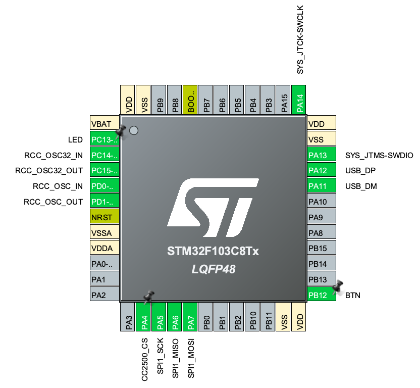
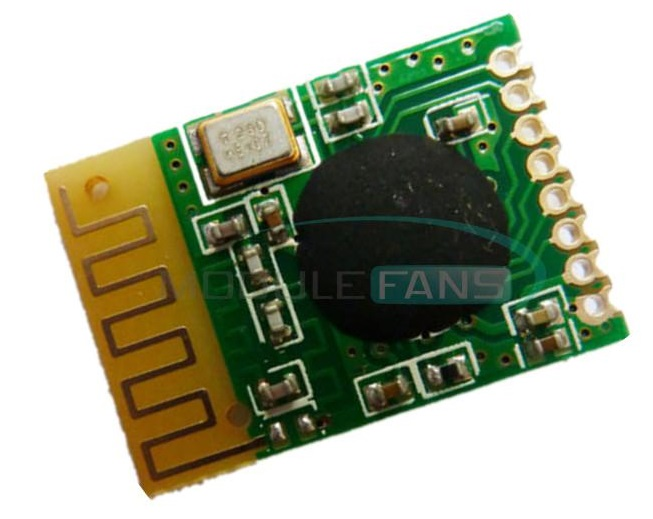
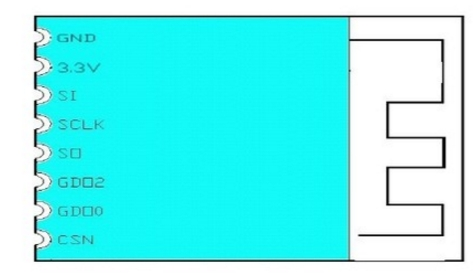

# FrSim - an STM32 wireless flight simulator dongle for FrSky radios

## Introduction

FrSim is a project to create a cheap and easy to build DIY receiver dongle that supports FrSky D8/D16 protocols.
BOM is $4, all parts are readily available, no SMD soldering needed.

## Why make another sim dongle?

There are existing Arduino based dongles available. I don't like Arduino and didn't have any USB Arduino boards on hand, so that was out.  
There are projects that include custom PCBs, but that seemed too involved for a project that was supposed to save me the cost of a proper $20 dongle.  
There might be some projects that fit the criteria but I missed. Anyway, I didn't spend too much time on this one, and enjoyed most of it, so that wasn't a waste :)

## Parts

- An STM32 Blue Pill board (STM32F103C8T6)
- A CC2500 RF module
- That's it!
- (Optional) a bind button. I cut the Reset button trace and reused it. You might have a pushbutton or a Reed switch handy.

## Building firmware

Currently you have to use STM32CubeIDE to build it. I'm sorry. I'll add a dockerfile if I see any stars or forks :) Or submit a PR yourself!

## Flashing firmware

You can use dfu-util to flash firmware using boot0 jumper to enter DFU. I think the best way is using Betaflight flasher - everyone already have Betaflight installed and it's pretty user friendly. Just go to Firmware tab, press the Local button and load ccsim.hex after connecting the board in DFU mode.

## Schematics

You need to connect 

### STM32 pins

### CC2500 module pins

24TRGC2 - that's the module I used. If yours looks different, please research its pinout before it goes puff.

- GND
- 3.3V
- SI - SPI MOSI
- SCLK - SPI CLK
- SO - MISO
- GDO2 - N/C
- GDO0 - N/C
- CSN - SPI chip select (inverted)

### Connections
- PA4 to CC2500_CSN
- PA5 to CC2500_CLK
- PA6 to CC2500_MISO
- PA7 to CC2500_MOSI
- PB12 to a pushbutton to GND.

## CAD files

(CAD)[CAD] - CAD files (Fusion 360 source and STLs) for the case
