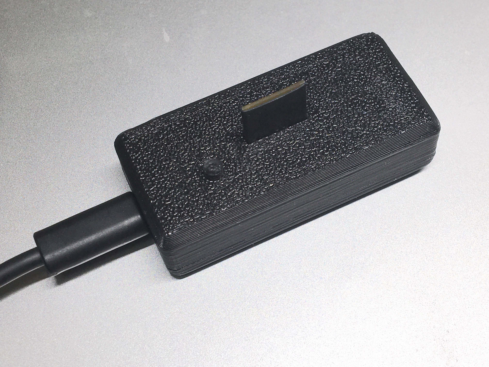

# FrSim - an STM32 wireless flight simulator USB dongle for FrSky radios

## Introduction

FrSim is a project to create a cheap and easy to build DIY wireless USB receiver dongle that supports FrSky D8/D16 protocols.
BOM is $4, all parts are readily available, no SMD soldering needed.

## Why make another sim dongle?

There are existing Arduino based dongles available. I don't like Arduino and didn't have any USB Arduino boards on hand, so that was out.  
There are projects that include custom PCBs, but that seemed too involved for a project that was supposed to save me the cost of a proper $20 dongle.  
There might be some projects that fit the criteria but I missed. Anyway, I didn't spend too much time on this one, and enjoyed most of it, so that wasn't a waste :)

## Parts

- An STM32 Blue Pill board (STM32F103C8T6)
- A CC2500 RF module
- That's it!
- (Optional) a bind button. I cut the Reset button trace and reused it. You might have a pushbutton or a Reed switch handy.

## Building firmware

Currently you have to use STM32CubeIDE to build it. I'm sorry. I'll add a dockerfile if I see any stars or forks :) Or submit a PR yourself!

## Flashing firmware

You can use dfu-util to flash firmware using boot0 jumper to enter DFU. I think the best way is using Betaflight flasher - everyone already have Betaflight installed and it's pretty user friendly. Just go to Firmware tab, press the Local button and load ccsim.hex after connecting the board in DFU mode.

## Schematics

You need to connect STM32 pins to the RF module according to the following 

### STM32 pins

### CC2500 module pins

24TRGC2 - that's the module I used. If yours looks different, please research its pinout before it goes puff.

- GND
- 3.3V
- SI - SPI MOSI
- SCLK - SPI CLK
- SO - MISO
- GDO2 - N/C
- GDO0 - N/C
- CSN - SPI chip select (inverted)

### Connections
- PA4 to CC2500_CSN
- PA5 to CC2500_CLK
- PA6 to CC2500_MISO
- PA7 to CC2500_MOSI
- PB12 to a pushbutton to GND.

## CAD files

[CAD](CAD) - CAD files (Fusion 360 source and STLs) for the case

## Using the damn thing

### Pairing
- Connect to USB while pressing the bind button
- Press Bind on the radio and wait for it to bind
- Unplug and re-plug the dongle

### RX mode
FrSky receiver mode is set to D16 V2 FCC in [frsky_rx.c](Core/Src/frsky_rx.c):  
`static uint8_t frsky_rx_format = FRSKY_RX_D16v2FCC;`.  
I haven't found a way to autodetect the receiver mode during bind and configuring a USB HID device isn't a pleasant task (there's no built-in GUI available to set parameters). Prebuilt firmware also uses that mode. Any suggestions of a user friendly way to set the RX mode are welcome.

### Calibration
Do joystick calibration the same as with wired connection.

### Controls
First 8 channels (1 to 8) are assigned to axes, next 8 (channels 9 to 16) - to buttons. Buttons are considered 'pressed' when channel value exceeds 15
00us.

## Used 3rd party code/credits

### DIY Multiprotocol Module - FrSky receiver code
[Multiprotocol TX Module](https://github.com/pascallanger/DIY-Multiprotocol-TX-Module) project - borrowed the receiver code from there. Might have been a mistake - the code was distinctly Arduino based - all source files were marked with .ino extensions as to warn others, all variables global, scattered across files, the only official way to build was from Arduino IDE (says the man who didn't provide a dockerfile..) At least the code supports D16/D16v2 protocols.  
License: GPLv3

[STM32Cube](https://www.st.com/en/ecosystems/stm32cube.html) - USB HID code and HAL library.  
License: who knows? but probably permissive.. unless you plan to use Chinese STM32 'GD32' clones :)

## License
Left as an exercise to the reader. My guess would be GPLv3 since, you know, DIY Multiprotocol is GPLv3 and that's where frsky_rx.c came from.